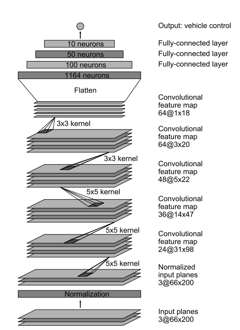
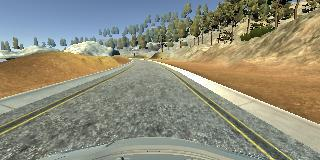

# Udacity Self-Driving Car Behavioral Cloning Project


**Note: This project makes use of a Udacity-developed driving simulator and training data collected from the simulator**

---

### Introduction
The objective of this project is to train a neural network, using data collected in simulator provided by Udacity to drive car autonomously.

The data consists of images captured by 3 dashboard cams center, left and right. The output data also contains a file ```data.csv```, which has the mappings of center, left and right images and the corresponding steering angle, throttle, brake and speed.

Using Keras Deep learning framework we can create a model.h5 file which we can test later on simulator with the command ```python drive.py model.h5```. This drive.py connects your model to simulator. The challenge in this project is to collect all sorts of training data so as to train the model to respond correctly in any type of situation.

---

### Files Submitted & Code Quality

#### 1. Submission includes all required files and can be used to run the simulator in autonomous mode

My project includes the following files:
* model.py containing the script to create and train the model
* drive.py for driving the car in autonomous mode
* model.h5 containing a trained convolution neural network
* ReadMe.md  summarizing the results

#### 2. Submission includes functional code

Using the Udacity provided simulator and ```drive.py``` file, the car can be driven autonomously around the track by executing
```sh
python drive.py model.h5
```

#### 3. Submission code is usable and readable

The ```model.py``` file contains the code for training and saving the convolution neural network. The file shows the pipeline I used for training and validating the model, and it contains comments to explain how the code works.

---

## Model Architecture and Training Strategy


###  Model Overview

* The model is loosely based on the paper "End to End Learning for Self-Driving Cars"[here](https://images.nvidia.com/content/tegra/automotive/images/2016/solutions/pdf/end-to-end-dl-using-px.pdf).

<p align="center">

</p>

### Loading Data

* Dataset provided by Udacity is used to train the network
* OpenCV is used to load the images, which by default is in BGR format and is converted to RGB format.
* Steering angle is increased by 0.2 For the left images and decreased by by 0.2 For the right images since the steering angle is captured by the center angle.

### Preprocessing

* Augmented data is generated by flipping the image horizontally and by multiplying the steering angle by a factor of -1 to get the steering angle for the flipped image.
* Using this approach 6 images is gathered corresponding to one entry in .csv file

### Creation of the Training Set & Validation Set

* Dataset is split into training, validation and test set using sklearn preprocessing library.
* Training, test and validation data is split in 81%,9% and 10% respectively.
* Augmented images are generated inside the generators.

### Final Model Architecture

<p align="center">

</p>

###### Input layer
  Input layer is normalized, such that the value should be between -05 to 0.5 . The shape of the layer is 160x320x3
  Using Cropping2D, the image is cropped. The shape of the layer is reduced to 65x320x3
###### First layer
  There is  first convolutional layer with 24 feature maps and filters having size 5×5 and a stride of two. The image dimensions changes from 65x320x3 to 31x158x24          

###### Second layer
There is  second convolutional layer with 36 feature maps and filters having size 5×5 and a stride of two. The image dimensions changes from 31x158x24 to 14x77x36

###### Third layer
There is  third convolutional layer with 48 feature maps and filters having size 5×5 and a stride of two. The image dimensions changes from 14x77x36 to 5x37x48

###### Fourth layer
There is  fourth convolutional layer with 64 feature maps and filters having size 3×3 and a stride of one. The image dimensions changes from 5x37x48 to 3x35x64

###### Fifth layer
There is  fifth convolutional layer with 64 feature maps and filters having size 3×3 and a stride of one. The image dimensions changes from 3x35x64 to 1x33x64

###### Sixth layer
The sixth layer is a fully connected layer (F6) with 100 units, followed by a dropout.

###### Seventh layer
The sixth layer is a fully connected layer (F7) with 50 units

###### Eighth layer
The sixth layer is a fully connected layer (F8) with 10 units

###### Ninth layer
The sixth layer is a fully connected layer (F9) with 1 units

###### Output layer
the output is the steering angle.

Model Training
The model is compiled with mean squared error loss function, and optimized using adam optimizer

### Model parameter tuning

* No of epochs= 5
* Optimizer Used- Adam
* Learning Rate- Default 0.001
* Validation Data split- 0.10
* test Data split- 0.10
* Generator batch size= 32
* Correction factor- 0.2
* Loss Function Used- MSE(Mean Squared Error as it is efficient for regression problem).

### Output Video
[](https://www.youtube.com/watch?v=n5nzkptUrOs)
